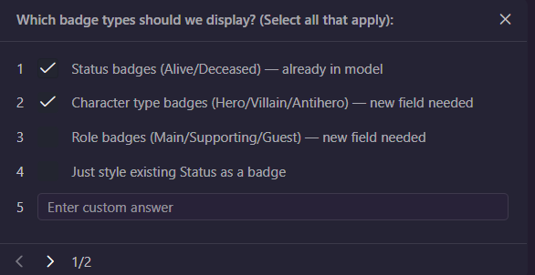
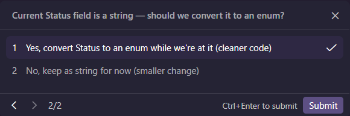

```
/plan Help me plan another small enhancement to the character detail page.

 This time I want to add status badges, like Hero, Villain, Alive, or Retired.
 Please use the existing FanHub patterns and give me:
 - the files I’d likely need to update
 - a good order for the work
 - any open questions I should answer first
 - tests I should include

 Keep this lightweight and don’t turn it into a bigger redesign.
```

---



---



---
